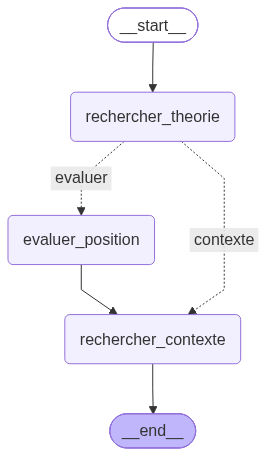
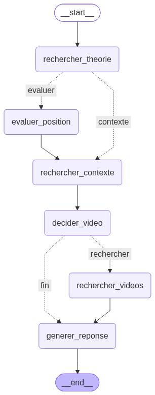

<p align="center">
  

 # Agent IA pour l'apprentissage des échecs, FFE (POC)
  **Mise en place un Agent IA pour l'apprentissage des échecs**

[](https://www.python.org)
[](https://fastapi.tiangolo.com)
[](https://langchain-ai.github.io/langgraph/)
[](https://milvus.io)
[](https://www.mongodb.com)
[](https://angular.dev)
[](https://www.docker.com)

</p>

**Documents complémentaires :**
- [Support de présentation (M13)](../docs/Suport_de_presentation-M13_Developpez_un_agent_IA_pour_lapprentissage_des_echecs.pdf)
- [Étude de faisabilité MCP](../docs/Etude_de_faisabilite_V1.pdf)

## Objectif

POC (Proof of Concept), développé pour la Fédération Française des
Échecs (FFE), d'un agent intelligent qui accompagne les jeunes espoirs
dans l'apprentissage des **ouvertures d'échecs** : coups théoriques
(Lichess), évaluation de position (Stockfish), contexte pédagogique sur
l'ouverture (RAG Wikichess/Wikipédia via Milvus), vidéos explicatives
(YouTube) et, dans sa variante avancée, une décision et une synthèse en
langage naturel confiées à un LLM (Gemini), le tout via un échiquier
interactif Angular.

L'architecture cible complète (composants, services Docker, services
externes, choix techniques) est détaillée dans
[`docs/ARCHITECTURE.md`](docs/ARCHITECTURE.md).

---

## Table des matières

- [Stack technique](#stack-technique)
- [Architecture (vue Docker)](#architecture-vue-docker)
- [Prérequis](#prérequis)
- [Démarrage rapide](#démarrage-rapide)
- **Étapes du projet**, chacune avec *ce qui s'installe*, *ce qui
  s'implémente* et *comment le tester* :
  - [Étape 1, Environnement de développement](#étape-1-environnement-de-développement)
  - [Étape 2, Agent de base : théorie et moteur](#étape-2-agent-de-base-théorie-et-moteur)
  - [Étape 3, RAG (Milvus)](#étape-3-rag-milvus)
  - [Agent LangGraph, version de base, sans LLM](#agent-langgraph-version-de-base-sans-llm)
  - [Étape 4, Vidéos explicatives (YouTube)](#étape-4-vidéos-explicatives-youtube)
  - [Agent LangGraph, variante LLM (décision + synthèse)](#agent-langgraph-variante-llm-décision-synthèse)
  - [LangGraph Studio](#langgraph-studio)
  - [Étape 5, Interface Angular](#étape-5-interface-angular-à-venir)
  - [Étape 6, Containerisation complète](#étape-6-containerisation-complète-à-venir)
  - [Étape 7, Étude de faisabilité MCP](#étape-7-étude-de-faisabilité-mcp-à-venir)
- [Key Commands (aide-mémoire complet)](#key-commands-aide-mémoire-complet)
- [Structure du dépôt](#structure-du-dépôt)
- [Avancement de la mission](#avancement-de-la-mission)
- [Points de vigilance](#points-de-vigilance)
- [Auteur](#auteur) / [Licence](#licence)

---

## Stack technique

| Couche | Technologie |
|---|---|
| Frontend | Angular + `ngx-chessboard` *(à venir, étape 5)* |
| Backend | FastAPI + LangGraph |
| Règles du jeu / validation FEN | `python-chess` |
| Moteur d'évaluation | Stockfish (binaire natif + wrapper Python `stockfish`) |
| Théorie des ouvertures | API Lichess (Opening Explorer), repli local Polyglot |
| RAG / contexte pédagogique | Milvus + `sentence-transformers` |
| Vidéos explicatives | API YouTube Data v3 (`google-api-python-client`) |
| Décision et synthèse LLM | Gemini (`gemini-flash-lite-latest`) |
| Persistance | MongoDB (checkpoints de session LangGraph) |
| Gestionnaire de paquets Python | `uv` |
| Orchestration | Docker Compose |
| Observabilité (dev) | LangGraph Studio (`langgraph-cli`) |

---

## Architecture (vue Docker)

```
+-----------------------------------------------------------------------+
| Poste de developpement (Docker Compose)                               |
|                                          port 8081                    |
|                       +-----------------------------+                 |
|                       |      Conteneur frontend     |                 |
|                       | Angular (nginx ou ng serve) |                 |
|                       +-----------------------------+                 |
|                                        | port 8000 (reseau docker)    |
|                                        |                              |
| +------------------------------------+ |                              |
| |   Stockfish n'est PAS un service   | |                              |
| |  Docker a part : binaire installe  | |                              |
| | dans l'image du conteneur backend, | |                              |
| |     appele en sous-processus.      | |                              |
| +------------------------------------+ v                              |
|                    +---------------------+ HTTPS +-------------+      |
|                    | Conteneur backend   |-----> | Lichess API |      |
|                    | FastAPI + Uvicorn   |       +-------------+      |
|                    | + Agent LangGraph   | HTTPS +------------------+ |
|                    | (base + variante    |-----> | YouTube Data API | |
|                    |  LLM)               |       +------------------+ |
|                    |                     | HTTPS +------------------+ |
|                    |                     |-----> | Gemini           | |
|                    +---------------------+       +------------------+ |
|                    | port 19530         | port 27017                  |
|                    v                    v                             |
|     +-----------------------------+    +-------------------+          |
|     | Conteneur milvus-standalone |    | Conteneur mongodb |          |
|     |            Milvus           |    |      MongoDB      |          |
|     +-----------------------------+    +-------------------+          |
|             | metadonnees       | stockage objets                     |
|             |                   |                                     |
|             v                   v                                     |
|     +----------------+  +-----------------+                           |
|     | Conteneur etcd |  | Conteneur minio |                           |
|     +----------------+  +-----------------+                           |
+-----------------------------------------------------------------------+
```

---

## Prérequis

- Git
- Docker et Docker Compose installés sur le poste
- Clé API YouTube Data v3 valide (voir [Étape 4](#étape-4-vidéos-explicatives-youtube))
- (à partir de l'étape 5) Node.js et Angular CLI

---

## Démarrage rapide

C'est la base indispensable avant toute autre étape, sans Docker
levé, rien d'autre ne peut être testé.

```bash
# 1. Cloner le dépôt
git clone <url-du-depot>
cd m13_ocr

# 2. Créer le fichier d'environnement local
cp .env.example .env
# Puis renseigner : YOUTUBE_API_KEY, ANTHROPIC_API_KEY (voir Prérequis)

# 3. Lancer tous les services (build complet)
docker compose up -d --build

# 4. Suivre les logs du backend (Ctrl+C pour arreter le suivi, sans stopper les conteneurs)
docker compose logs -f backend
```

Vérifier que tous les services sont sains :

```bash
docker compose ps
```

Vérifier que le backend répond :

```bash
curl http://localhost:8000/api/v1/healthcheck
```

Réponse attendue :

```json
{"status": "ok", "application": "FFE Chess Agent - Backend", "version": "0.1.0"}
```

Depuis un autre poste du réseau local (remplacer par l'IP de la
machine hôte) :

```
http://192.168.1.146:8081/api/v1/healthcheck   # via le frontend (port 8081)
http://192.168.1.146:8000/docs                  # directement sur l'API (port 8000)
```

> ⚠️ **Le premier build est long** (≈ 30-40 min, PyTorch notamment) et
> les premières requêtes vers `/vector-search`, `/agent/invoke` et
> `/agent-llm/invoke` déclenchent le téléchargement à froid du modèle
> d'embeddings depuis Hugging Face (`Warning: unauthenticated requests
> to the HF Hub` dans les logs, normal, pas une erreur). Patienter
> avant de conclure à un blocage.

---

## Étape 1, Environnement de développement

**S'installe** : Git, Docker Desktop, structure `backend/`/`frontend/`.

**S'implémente** : `docker-compose.yml` de base, `Dockerfile` du
backend, endpoint `GET /api/v1/healthcheck`.

**Se teste** :
```bash
docker compose up -d --build
curl http://localhost:8000/api/v1/healthcheck
```

---

## Étape 2, Agent de base : théorie et moteur

**S'installe** : `python-chess`, `stockfish` (binaire + wrapper Python),
`httpx`.

**S'implémente** :
- `GET /api/v1/moves/{fen}`, coups théoriques (Lichess, avec repli
  Polyglot local si Lichess est indisponible)
- `GET /api/v1/evaluate/{fen}`, évaluation Stockfish (centipawns/mat,
  coup recommandé, profondeur)
- `GET /api/v1/explore/{fen}`, théorie si trouvée, sinon Stockfish
  (bifurcation codée à la main, base du futur graphe LangGraph)

**Se teste** :
```bash
cd backend
uv sync --group test
uv run pytest -v

# Verification manuelle contre un backend demarre
uv run python scripts/test_endpoints.py --base-url http://localhost:8000
```

> ⚠️ **Point de vigilance connu** : le service public
> `explorer.lichess.ovh` peut traverser des pannes d'infrastructure.
> Tant que dure une panne, `/moves/{fen}` répond `200` avec le repli
> Polyglot (ou liste vide si la ligne n'est pas couverte) au lieu des
> coups Lichess réels, dégradation gracieuse voulue, pas un bug.
> `/evaluate/{fen}` n'est pas concerné (Stockfish tourne localement).

### Résilience de `/moves/{fen}` : repli local Polyglot

1. Tente d'abord l'**API Lichess** (Opening Explorer).
2. Si elle échoue ou renvoie une liste vide, retombe sur un **livre
   Polyglot local** (`data/polyglot/livre_ouvertures.bin`), sans appel
   réseau.

```json
[
  {"uci": "e2e4", "san": "e4", "nombre_parties": 1},
  {"uci": "d2d4", "san": "d4", "nombre_parties": 1}
]
```

> ⚠️ Pour les entrées venant du livre Polyglot, `nombre_parties` est en
> réalité le *poids* (`weight`) du livre, réutilisé par simplicité dans
> le même champ que Lichess.

### Réponse enrichie de `/evaluate/{fen}`

```json
{
  "fen": "rnbqkbnr/pppppppp/8/8/8/8/PPPPPPPP/RNBQKBNR w KQkq - 0 1",
  "evaluation": { "type": "cp", "valeur": 39, "score": "+0.39" },
  "coup_recommande": "e2e4",
  "profondeur": 15
}
```

> ⚠️ **Décision en attente** : champs nommés en français
> (`valeur`, `coup_recommande`, `profondeur`). Si un client externe
> attend des noms anglais, changement isolé à `app/api/v1/schemas.py`.

---

## Étape 3, RAG (Milvus)

**S'installe** : `pymilvus`, `sentence-transformers`, `beautifulsoup4`.

**S'implémente** :
- Pipeline d'ingestion : `fetch_wikichess.py` + `fetch_wikipedia.py` →
  `build_corpus.py` → `indexer_corpus.py`
- `GET /api/v1/vector-search?q=...`, recherche vectorielle de contexte

```
data/seeds/*.csv (curés à la main)
        |
        v
scripts/ingestion/fetch_wikichess.py    scripts/ingestion/fetch_wikipedia.py
        |                                        |
        v                                        v
data/raw/wikichess/*.json               data/raw/wikipedia/*.json
        |                                        |
        +------------------+---------------------+
                            v
             scripts/ingestion/build_corpus.py
                            |
                            v
                   data/corpus/*.md
                            |
                            v
             scripts/ingestion/indexer_corpus.py  (-> Milvus)
```

**Se teste** :
```bash
cd backend

# Ingestion (une seule fois, ou apres mise a jour des seeds)
python scripts/ingestion/fetch_wikichess.py
python scripts/ingestion/fetch_wikipedia.py
python scripts/ingestion/build_corpus.py

# Indexation dans Milvus (hors Docker : forcer localhost)
$env:MILVUS_HOST="localhost"          # PowerShell
uv run python scripts/ingestion/indexer_corpus.py
uv run python scripts/ingestion/diagnostic_milvus.py

# Endpoint
curl "http://localhost:8000/api/v1/vector-search?q=sicilienne&top_k=3"
```

Réponse attendue (`200`, liste vide = réponse valide, pas une erreur) :
```json
[{"texte": "...", "ouverture": "Défense sicilienne",
  "source_url": "https://fr.wikipedia.org/wiki/...", "score": 0.87}]
```

> ⚠️ **`MILVUS_HOST`** : `localhost` pour un script lancé depuis
> l'hôte, `milvus-standalone` pour le backend dans le réseau Docker
> (déjà configuré, ne pas mettre `MILVUS_HOST=localhost` dans le `.env`
> partagé, casserait le backend en conteneur).
>
> **`data/raw/` et `data/corpus/` sont dans `.gitignore`**, artefacts
> régénérables. Seul `data/seeds/*.csv` est versionné.

### Points de vigilance découverts en conditions réelles

- **API Wikimedia** : exige un `User-Agent` descriptif, sans lui,
  `403 Forbidden` systématique.
- **Wikichess** : contenu repéré via `<div align="justify">` contenant
  le séparateur `====`, pas un motif de texte global.
- Chaque échec Wikichess sauvegarde son HTML brut dans
  `data/raw/_debug/`, sans bloquer le reste du traitement.
- Traçabilité complète via `LogTool` (paramètres, première entrée,
  compte final réussies/échouées).

---

## Agent LangGraph, version de base, sans LLM

**S'installe** : `langgraph`, `langgraph-checkpoint-mongodb`, `pymongo`.

**S'implémente** : `POST /api/v1/agent/invoke`, orchestre via un
`StateGraph` LangGraph les services des étapes 2 et 3, sans LLM,
100 % déterministe :

```
        rechercher_theorie
              |
        theorie trouvee ? ---- oui ---> rechercher_contexte -> FIN
              |
             non
              |
        evaluer_position -> rechercher_contexte -> FIN
```



**Se teste** :
```bash
cd backend
uv run pytest tests/test_agent_graphe.py -v   # 3 tests, doublures, sans reseau

# Contre un backend demarre (PowerShell, sans curl)
$body = @{
    fen        = "rnbqkbnr/pppppppp/8/8/8/8/PPPPPPPP/RNBQKBNR w KQkq - 0 1"
    id_session = "demo-1"
} | ConvertTo-Json
Invoke-RestMethod -Uri "http://localhost:8081/api/v1/agent/invoke" -Method Post -Body $body -ContentType "application/json"
```

Réponse attendue (`evaluation: null` si théorie trouvée) :
```json
{
  "fen": "...",
  "coups_theoriques": [{"uci": "e2e4", "san": "e4", "nombre_parties": 1}],
  "evaluation": null,
  "contexte_ouverture": [{"ouverture": "Variante Breyer", "score": 0.48, "source_url": "...", "texte": "..."}]
}
```

### Persistance MongoDB

```bash
docker compose exec mongodb mongosh ffe_agent_checkpoints --eval "db.checkpoints.countDocuments()"

# Lister les collections existants
docker compose exec mongodb mongosh ffe_agent_checkpoints --eval "db.getCollectionNames()"

[ 'checkpoints', 'checkpoint_writes' ]

# Lister les differents thread_id avec le nombre  d'entrees de chacun.
docker compose exec mongodb mongosh ffe_agent_checkpoints --eval "db.checkpoints.aggregate([{ `$group: { _id: '`$thread_id', total: { `$sum: 1 } } }, { `$sort: { total: -1 } }])"

[
  { _id: 'demo-insomnia-1', total: 39 },
  { _id: 'prueba-llm-1', total: 14 },
  { _id: 'prueba-original-1', total: 8 },
  { _id: 'demo-1', total: 8 },
  { _id: 'demo-curl-1', total: 4 }
]

# Le dernier checkpoint
$env:MONGO_URI = "mongodb://localhost:27017"
uv run python scripts/inspeccionar_checkpoint.py --thread-id demo-insomnia-1

# Tout le historial (un por chaque invocation)
uv run python scripts/inspeccionar_checkpoint.py --thread-id demo-insomnia-1 --historique

# Sur le graphe avec LLM
uv run python scripts/inspeccionar_checkpoint.py --thread-id prueba-llm-1 --graphe agent_llm

```
Le compteur augmente à chaque appel avec le même `id_session`.

> ⚠️ **Point de vigilance non résolu** : `MONGO_URI` peut pointer vers
> `/ffe_chess` dans `.env`, mais `MongoDBSaver` reçoit `db_name`
> explicitement (`ffe_agent_checkpoints`), qui **prend le pas** sur le
> nom de l'URI. Décision à trancher : base séparée (état actuel) ou
> partagée avec `ffe_chess`.

### Visualiser le graphe

```bash
uv run python scripts/visualiser_graphe.py
```
Génère `docs/images/graphe_agent.png` (repli en `.mermaid` sans accès
à `mermaid.ink`).

---

## Étape 4, Vidéos explicatives (YouTube)

**S'installe** : `google-api-python-client`.

**S'implémente** (architecture hexagonale complète, indépendante du
graphe) :
- `PortRechercheVideos` (domaine) → `AdaptateurYoutube` (infrastructure)
- `RechercherVideosService` (application), requête intelligente
  (`"{ouverture} chess opening tutorial explanation"`)
- `GET /api/v1/videos/{ouverture}`
- **Filtre qualité** : durée (2-40 min, écarte Shorts et cours de
  plusieurs heures) + vues minimum, via un second appel
  `videos().list()` peu coûteux en quota
- Gestion des erreurs de quota (`HttpError`) et de réseau
  (SSL/proxy/DNS), dégrade toujours vers une liste vide, jamais de 500

**Se teste**, en 3 niveaux indépendants :
```bash
cd backend

# 1. Smoke-test isole (ni le projet, ni l'adaptateur)
uv run python scripts/test_youtube_smoke.py "Sicilian defense chess opening"

# 2. A travers l'adaptateur reel (real API, hors architecture DI)
uv run python scripts/test_youtube_adapter.py --ouverture "Ruy Lopez"

# 3. Tests automatises (doublure FauxRechercheVideos, sans reseau)
uv run pytest tests/test_videos.py -v

# 4. Endpoint complet (backend demarre)
curl http://localhost:8000/api/v1/videos/Sicilienne
```

> ⚠️ Nécessite `YOUTUBE_API_KEY` dans `.env` (voir [Prérequis](#prérequis)).
> `load_dotenv()` charge automatiquement le `.env` local **uniquement**
> pour ce qui passe par `app.core.dependances` (l'app FastAPI, `pytest`).
> Les scripts autonomes (`test_youtube_smoke.py`,
> `test_youtube_adapter.py`) chargent `.env` eux-mêmes.

---

## Agent LangGraph, variante LLM (décision + synthèse)

**S'installe** : `langchain-anthropic` (déjà présent depuis le début
du projet, jamais invoqué avant cette étape).

**S'implémente**, dans des fichiers **séparés** de la version de base
(`*_llm.py` partout, aucune régression possible sur
`POST /api/v1/agent/invoke`, qui reste inchangé) :

```
        rechercher_theorie
              |
        theorie trouvee ? ---- oui ---> rechercher_contexte
              |                                |
             non                       decider_video (LLM)
              |                                |
        evaluer_position                video utile ? -oui-> rechercher_videos
              |                                |                    |
              `-----> rechercher_contexte      `-non--> generer_reponse (LLM) <-'
                                                               |
                                                              FIN
```



- **`decider_video`**, le LLM décide, avec sortie structurée
  (Pydantic, pas de texte à parser), s'il vaut la peine de chercher une
  vidéo et avec quel terme (nom réel de l'ouverture, pas le FEN brut)
- **`generer_reponse`**, synthèse pédagogique en 2-4 phrases pour un
  jeune joueur
- `POST /api/v1/agent-llm/invoke`, même contrat d'entrée que
  `/agent/invoke`, réponse enrichie de `videos` et `explication`
- **Dégradation gracieuse** : si l'appel LLM échoue (clé absente,
  quota, réseau), repli sur une heuristique simple, ne bloque jamais
  la réponse HTTP

**Se teste** :
```bash
cd backend
uv run pytest tests/test_agent_graphe_llm.py -v   # 4 tests, doublures, sans reseau/cle

$body = @{
    fen        = "rnbqkbnr/pppppppp/8/8/8/8/PPPPPPPP/RNBQKBNR w KQkq - 0 1"
    id_session = "demo-llm-1"
} | ConvertTo-Json
Invoke-RestMethod -Uri "http://localhost:8081/api/v1/agent-llm/invoke" -Method Post -Body $body -ContentType "application/json"
```

Réponse attendue, en plus des champs de `/agent/invoke` :
```json
{
  "videos": [{"id_video": "...", "titre": "...", "chaine": "...", "url": "...", "vues": 890000}],
  "explication": "La Sicilienne est une réponse ambitieuse à 1.e4, offrant..."
}
```

> ⚠️ Nécessite `ANTHROPIC_API_KEY` dans `.env`, obtenue sur
> [platform.claude.com](https://platform.claude.com) (**pas**
> `claude.ai`, qui est l'interface de chat, sans clés API), moyen de
> paiement requis, facturation à l'usage. Modèle par défaut :
> `claude-haiku-4-5-20251001`, changeable via `ANTHROPIC_MODEL` dans
> `.env`, sans toucher au code.

> ⚠️ **Piège rencontré en conditions réelles, à connaître** :
> `EtatAgent` (`app/application/agent/etat_agent.py`) est un
> `TypedDict`. LangGraph ignore **silencieusement** toute clé renvoyée
> par un nœud si elle n'y est pas déclarée, aucune erreur, la valeur
> disparaît simplement du résultat final. Tout nouveau champ ajouté par
> un nœud doit être déclaré dans `EtatAgent` **avant** d'écrire le
> nœud, jamais après.

### Vérification croisée des fichiers du volet LLM

Avant `pytest`/Docker, si un fichier a pu rester à une version
intermédiaire :
```bash
uv run python scripts/verificar_archivos_llm.py
```

### Visualiser le graphe LLM

```bash
uv run python scripts/visualiser_graphe_llm.py
```
Génère `docs/images/graphe_agent_llm.png`.

---

## LangGraph Studio

Outil de développement optionnel, IDE visuel pour explorer et
déboguer un graphe pas à pas, sans dépendre de Docker.

**S'installe** : `langgraph-cli[inmem]`.

**S'implémente** : `langgraph.json` déclare deux graphes distincts,
chacun en deux variantes (doublures / services réels) :

| Fichier | Graphe | Services |
|---|---|---|
| `app/studio_graph.py` | `agent` (base) | Doublures |
| `app/studio_graph_reel.py` | `agent` (base) | Réels |
| `app/studio_graph_llm.py` | `agent_llm` | Doublures |
| `app/studio_graph_reel_llm.py` | `agent_llm` | Réels (Stockfish local, Milvus/YouTube/Anthropic réels) |

**Se teste** :
```bash
cd backend
uv run langgraph dev
```
Ouvrir `https://smith.langchain.com/studio/?baseUrl=http://127.0.0.1:2024`
(un compte gratuit [smith.langchain.com](https://smith.langchain.com)
est nécessaire, Studio est hébergé, mais l'exécution et les données
restent 100 % locales).

Pour un accès distant :
```bash
uv run langgraph dev --tunnel
```

> ⚠️ **Jamais `--host 0.0.0.0` + redirection de port routeur**,
> exposerait un serveur de développement sans authentification à tout
> Internet. `--tunnel` est la voie sûre pour un accès distant.
>
> À chaque redémarrage du tunnel, l'URL Cloudflare change et doit être
> reconfirmée dans les *Advanced Settings* de Studio (liste blanche de
> domaines, protection contre un lien malveillant pointant vers un
> faux serveur).

---

## Étape 5, Interface Angular 

**Installé** : Angular 18 (standalone), `ngx-chess-board@2.2.3`
(`--legacy-peer-deps`, requis pour la compatibilité avec `@angular/cdk@17`).

**Implémenté** : échiquier interactif synchronisé avec l'état FEN,
horloge par joueur, historique de coups navigable (retour/avance),
panneau de recommandations (coups théoriques cliquables, ouverture
détectée avec code ECO, explication pédagogique générée par le LLM
avec coups en gras cliquables, barre d'évaluation, vidéos suggérées),
panneau d'administration pour tester manuellement chaque endpoint.

```bash
http://localhost:8081/
```

---

## Étape 6, Containerisation complète 

**Vérifié** : démarrage à froid de bout en bout (sept conteneurs :
frontend, backend, etcd, minio, milvus, mongodb), dépendances
ordonnées via `depends_on` + `condition: service_healthy`, cinq
volumes Docker nommés persistants (`milvus_data`, `etcd_data`,
`minio_data`, `mongo_data`, `huggingface_cache`).

```bash
docker compose down -v      # reset complet, y compris les volumes
docker compose up -d --build
docker compose ps           # verifie que tous les services sont "healthy"
```

---

## Étape 7, Étude de faisabilité MCP 

**Conçu** (conception uniquement, non développée) : note sur les
bénéfices/limites, schéma d'architecture MCP, étude de coûts (CAPEX +
OPEX) pour le système avancé d'analyse vidéo (board-to-FEN +
timestamp), demandé par Alan comme volet stratégique de la mission.
Principe directeur : le système ajoute une couche de précision qui
s'active lorsque c'est possible, avec une dégradation élégante
lorsque ce n'est pas le cas.

Document complet : [`docs/Etude_de_faisabilite_V1.pdf`](docs/Etude_de_faisabilite_V1.pdf)


---

## Key Commands (aide-mémoire complet)

```bash
# ══════════════════════════════════════════════════════════════
# DOCKER, toujours en premier, base de tout le reste
# ══════════════════════════════════════════════════════════════
docker compose up -d --build          # build complet + demarrage
docker compose up -d; docker compose logs -f backend   # demarrage + suivi logs
docker compose ps                     # etat de tous les services
docker compose down                   # arret propre
docker compose build --no-cache backend ; docker compose up -d backend  # rebuild cible

# ══════════════════════════════════════════════════════════════
# ÉTAPE 1-2, healthcheck, moves, evaluate
# ══════════════════════════════════════════════════════════════
curl http://localhost:8000/api/v1/healthcheck
curl http://192.168.1.146:8081/api/v1/healthcheck   # via frontend, reseau local
uv run pytest -v
uv run python scripts/test_endpoints.py --base-url http://localhost:8081
uv run python scripts/test_endpoints.py --base-url http://localhost:8081 --test evaluate
uv run python scripts/test_endpoints.py --base-url http://localhost:8081 --test moves-invalide

# ══════════════════════════════════════════════════════════════
# ÉTAPE 3, ingestion + RAG Milvus
# ══════════════════════════════════════════════════════════════
$env:MILVUS_HOST="localhost"
uv run python scripts/ingestion/drop_collection.py
uv run python scripts/ingestion/fetch_wikichess.py
uv run python scripts/ingestion/fetch_wikipedia.py
uv run python scripts/ingestion/build_corpus.py
uv run python scripts/ingestion/indexer_corpus.py
uv run python scripts/ingestion/diagnostic_milvus.py
curl "http://localhost:8000/api/v1/vector-search?q=sicilienne"
Invoke-WebRequest -Uri "http://localhost:8000/api/v1/vector-search?q=sicilienne" -UseBasicParsing
Invoke-WebRequest -Uri http://localhost:9091/healthz -UseBasicParsing   # sante Milvus

# ══════════════════════════════════════════════════════════════
# AGENT LANGGRAPH, base (sans LLM)
# ══════════════════════════════════════════════════════════════
uv run pytest tests/test_agent_graphe.py -v
uv run python scripts/visualiser_graphe.py
$body = @{ fen = "rnbqkbnr/pppppppp/8/8/8/8/PPPPPPPP/RNBQKBNR w KQkq - 0 1"; id_session = "demo-1" } | ConvertTo-Json
Invoke-RestMethod -Uri "http://localhost:8081/api/v1/agent/invoke" -Method Post -Body $body -ContentType "application/json"
docker compose exec mongodb mongosh ffe_agent_checkpoints --eval "db.checkpoints.countDocuments()"

# ══════════════════════════════════════════════════════════════
# ÉTAPE 4, vidéos YouTube
# ══════════════════════════════════════════════════════════════
uv run python scripts/test_youtube_smoke.py "Sicilian defense chess opening"
uv run python scripts/test_youtube_adapter.py --ouverture "Ruy Lopez"
uv run pytest tests/test_videos.py -v
curl http://localhost:8000/api/v1/videos/Sicilienne
uv run python scripts/test_endpoints.py --base-url http://localhost:8081 --test videos

# ══════════════════════════════════════════════════════════════
# AGENT LANGGRAPH, variante LLM (décision + synthèse)
# ══════════════════════════════════════════════════════════════
uv run pytest tests/test_agent_graphe_llm.py -v
uv run python scripts/verificar_archivos_llm.py
uv run python scripts/visualiser_graphe_llm.py
$body = @{ fen = "rnbqkbnr/pppppppp/8/8/8/8/PPPPPPPP/RNBQKBNR w KQkq - 0 1"; id_session = "demo-llm-1" } | ConvertTo-Json
Invoke-RestMethod -Uri "http://localhost:8081/api/v1/agent-llm/invoke" -Method Post -Body $body -ContentType "application/json"

# ══════════════════════════════════════════════════════════════
# LANGGRAPH STUDIO
# ══════════════════════════════════════════════════════════════
uv run langgraph dev
uv run langgraph dev --tunnel

# ══════════════════════════════════════════════════════════════
# DIVERS
# ══════════════════════════════════════════════════════════════
docker compose exec backend {commande}     # executer une commande dans le conteneur
uv sync --group test --group dev            # tout installer (pytest, ruff, langgraph-cli...)
uv run ruff check app/ scripts/ tests/       # lint
```

---

## Structure du dépôt

```
.
├── backend/                    # API FastAPI + agent LangGraph (Python, uv)
│   ├── app/
│   │   ├── api/v1/               # Présentation : routes REST + schémas
│   │   │   ├── healthcheck.py
│   │   │   ├── moves.py            # GET /moves/{fen}
│   │   │   ├── evaluate.py         # GET /evaluate/{fen}
│   │   │   ├── explore.py          # GET /explore/{fen}
│   │   │   ├── vector_search.py    # GET /vector-search  (RAG)
│   │   │   ├── videos.py           # GET /videos/{ouverture}  (YouTube)
│   │   │   ├── agent.py            # POST /agent/invoke  (LangGraph, base)
│   │   │   ├── agent_llm.py        # POST /agent-llm/invoke  (LangGraph, LLM)
│   │   │   └── schemas.py
│   │   ├── domaine/                # Modèles + ports, sans dépendances
│   │   │   ├── modeles.py            # CoupTheorique, Evaluation, ExtraitConnaissance,
│   │   │   │                           VideoExplicative, ResultatExploration
│   │   │   └── ports/
│   │   │       └── port_recherche_videos.py
│   │   ├── application/            # Cas d'utilisation (orchestrent les ports)
│   │   │   ├── rechercher_videos_service.py
│   │   │   └── agent/                # StateGraph LangGraph
│   │   │       ├── etat_agent.py       # EtatAgent (TypedDict, partagé base+LLM)
│   │   │       ├── noeuds_agent.py     # Nœuds déterministes (base)
│   │   │       ├── noeuds_agent_llm.py # Nœuds LLM (décision, synthèse, exécution video)
│   │   │       ├── graphe_agent.py     # Graphe de base (sans LLM, inchangé)
│   │   │       └── graphe_agent_llm.py # Graphe variante LLM (fichier séparé)
│   │   ├── infrastructure/         # Adaptateurs concrets (python-chess, Lichess,
│   │   │                             Stockfish, Milvus, YouTube, MongoDBSaver)
│   │   │   └── adaptateur_youtube.py
│   │   ├── core/                   # Configuration + câblage des dépendances
│   │   │   └── dependances.py        # obtenir_graphe_agent / _llm, obtenir_modele_decision...
│   │   ├── studio_graph.py         # LangGraph Studio : graphe base, doublures
│   │   ├── studio_graph_reel.py    # LangGraph Studio : graphe base, services réels
│   │   ├── studio_graph_llm.py     # LangGraph Studio : graphe LLM, doublures
│   │   ├── studio_graph_reel_llm.py# LangGraph Studio : graphe LLM, services réels
│   │   └── main.py                 # Point d'entrée de l'application
│   ├── tests/                      # Tests pytest (doublures des ports)
│   │   ├── fakes.py                  # Doublures partagées, dont FauxModeleDecision
│   │   ├── test_agent_graphe.py      # Graphe de base (3 tests)
│   │   ├── test_agent_graphe_llm.py  # Graphe variante LLM (4 tests)
│   │   └── test_videos.py            # Endpoint YouTube (2 tests)
│   ├── scripts/
│   │   ├── ingestion/                # Pipeline RAG (fetch/build/index)
│   │   ├── test_endpoints.py         # Vérification manuelle, LogTool, --test <nom>
│   │   ├── test_youtube_smoke.py     # Smoke-test YouTube isolé
│   │   ├── test_youtube_adapter.py   # Test via AdaptateurYoutube réel
│   │   ├── verificar_archivos_llm.py # Vérifie la cohérence des fichiers du volet LLM
│   │   ├── visualiser_graphe.py      # PNG du graphe de base
│   │   └── visualiser_graphe_llm.py  # PNG du graphe variante LLM
│   ├── docs/images/                  # Schémas générés (graphe_agent*.png)
│   ├── langgraph.json                # Déclaration des graphes pour Studio
│   ├── Dockerfile
│   └── pyproject.toml
├── frontend/                   # Application Angular (à partir de l'étape 5)
├── docs/
│   └── ARCHITECTURE.md         # Architecture cible + diagrammes PlantUML
├── docker-compose.yml           # backend, frontend, milvus, etcd, minio, mongodb
├── .env.example
└── README.md
```

---

## Avancement de la mission

| Étape | Contenu | Statut |
|---|---|---|
| 1 | Environnement de dev, `docker-compose.yml`, healthcheck | ✅ terminé |
| 2 | Agent de base : `/moves/{fen}`, `/evaluate/{fen}`, `/explore/{fen}` | ✅ terminé |
| 3 | RAG Milvus : ingestion, indexation, `/vector-search` | ✅ terminé |
| , | Agent LangGraph, version de base (`/agent/invoke`) | ✅ terminé |
| 4 | Intégration API YouTube (`/videos/{ouverture}`) | ✅ terminé |
| , | Agent LangGraph, variante LLM (`/agent-llm/invoke`, décision + synthèse) | ✅ terminé |
| , | LangGraph Studio (exploration/débogage visuel) | ✅ opérationnel |
| 5 | Interface Angular (`ngx-chess-board`) | ✅ terminé |
| 6 | Containerisation complète + démo | ✅ terminé |
| 7 | Étude de faisabilité : système MCP d'analyse vidéo (conception) | ✅ terminé |

| # | Service | Étape | Statut | Commande de test |
|---|---|---|---|---|
| 1 | **Notre API** (backend FastAPI) | 1 | ✅ | `curl http://localhost:8000/api/v1/healthcheck` |
| 2 | **python-chess** (validation FEN) | 2 | ✅ | `curl http://localhost:8000/api/v1/moves/ceci-nest-pas-un-fen` *(attend 422)* |
| 3 | **Stockfish** | 2 | ✅ | `curl http://localhost:8000/api/v1/evaluate/{fen}` |
| 4 | **Lichess API** (+ repli Polyglot) | 2 | ✅ | `curl http://localhost:8000/api/v1/moves/{fen}` |
| 5 | **etcd** (métadonnées Milvus) | 3 | ✅ | `docker compose exec etcd etcdctl endpoint health` |
| 6 | **minio** (stockage objets Milvus) | 3 | ✅ | `curl -I http://localhost:9002/minio/health/live` |
| 7 | **Milvus** | 3 | ✅ | `curl http://localhost:9091/healthz` |
| 8 | **LangGraph** (base) |, | ✅ | `POST /api/v1/agent/invoke` |
| 9 | **YouTube API** | 4 | ✅ | `curl http://localhost:8000/api/v1/videos/Sicilienne` |
| 10 | **MongoDB** (checkpoints) |, | ✅ | `mongosh "mongodb://localhost:27017" --eval "db.runCommand({ping:1})"` |
| 11 | **Anthropic Claude** (décision + synthèse) |, | ✅ | `POST /api/v1/agent-llm/invoke` |
| 12 | **LangGraph Studio** |, | ✅ | `uv run langgraph dev` |

---

## Points de vigilance

- Versions de Python (3.12) et Node.js figées dans les `Dockerfile`
  pour la reproductibilité.
- Ports exposés configurables via `.env`.
- Stockfish est installé dans l'image Docker du backend
  (`apt-get install stockfish`) ; en local hors Docker,
  `STOCKFISH_PATH` doit être défini dans `.env`.
- Les appels aux API externes (Lichess, YouTube, Anthropic) sont
  volontairement tolérants aux pannes : une indisponibilité externe
  dégrade la réponse (liste vide, repli heuristique), ne fait jamais
  planter l'agent.
- **`uv run ...` doit toujours être lancé depuis `backend/`**,
  exécuté depuis la racine du dépôt, `uv` ne trouve ni le
  `pyproject.toml`, ni le `.venv`, ni les scripts du projet.
- **PowerShell natif** : `curl` y est un alias d'`Invoke-WebRequest`,
  incompatible avec la syntaxe `-H`/`-d` habituelle. Utiliser
  `curl.exe` explicitement, `Invoke-RestMethod`, ou WSL2.
- **`.env` partagé** entre Docker et l'exécution locale : une variable
  utile en local (ex. `MILVUS_HOST=localhost` pour un script lancé
  hors Docker) peut casser le backend en conteneur si elle y reste,
  préférer une variable de session (`$env:...`) pour un usage ponctuel.
- **`EtatAgent`** (`TypedDict`) : LangGraph ignore silencieusement
  toute clé d'état non déclarée, voir l'avertissement dans la section
  [variante LLM](#agent-langgraph-variante-llm-décision-synthèse).
- `backend/.langgraph_api/` (cache runtime de `langgraph dev`) est
  ignoré par git, se régénère seul, ne jamais le committer.

---

## Auteur

**Rafael Cerezo Martín**

- Email : [rafael.cerezo.martin@icloud.com](mailto:rafael.cerezo.martin@icloud.com)
- GitHub : [@racemartin](https://github.com/racemartin)

---

## Licence

MIT License, voir [LICENSE](LICENSE) pour les détails.
