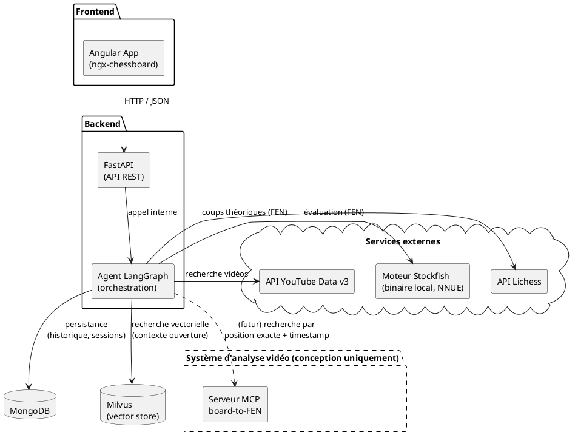
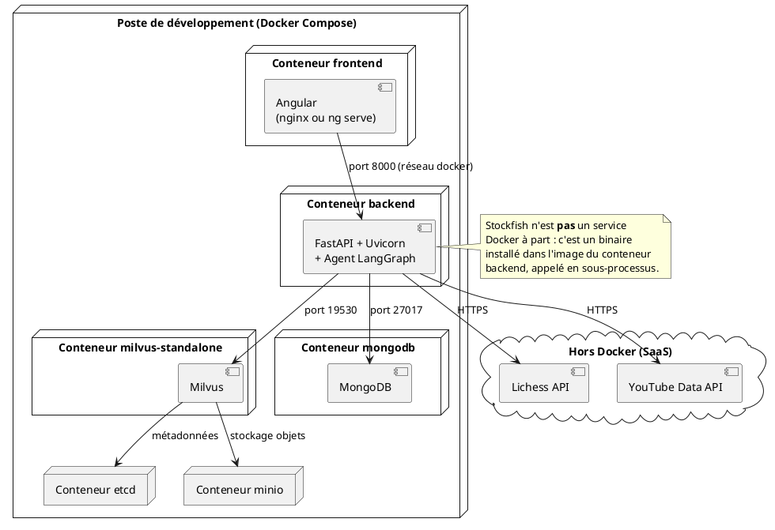
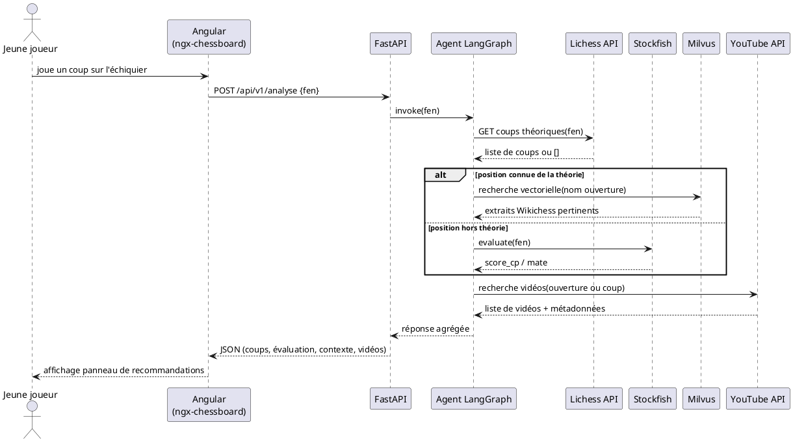

# Architecture, Agent IA pour l'apprentissage des échecs (FFE)

Ce document décrit l'architecture cible du POC demandé par Alan pour la
Fédération Française des Échecs, telle qu'elle ressort de la note de
mission. Il couvre les composants, les services Docker, les services
externes, les flux entre backend/frontend, et documente les choix
d'architecture pour les points où l'énoncé laisse le champ libre.

> Cette architecture correspond à la cible finale (étapes 1 à 6 de la
> mission). L'étape 1 n'en implémente qu'une fraction minimale (voir
> `README.md`). Le système d'analyse vidéo MCP (étape 7) est traité à
> part : il est **conçu**, pas développé, et apparaît en pointillés
> dans les diagrammes ci-dessous.

---

## 1. Objectif du système

Fournir à un jeune joueur d'échecs, via une interface web avec échiquier
interactif, un agent capable de :

- proposer les coups théoriques d'une position (Lichess),
- évaluer la position avec un moteur d'échecs si elle sort de la
  théorie (Stockfish),
- donner du contexte textuel sur l'ouverture jouée (RAG sur Wikichess
  via Milvus),
- suggérer des vidéos YouTube pertinentes pour la position en cours.

---

## 2. Vue d'ensemble des composants

**Lecture du schéma** : le frontend Angular ne parle qu'au backend
FastAPI. Toute la logique d'orchestration (quel service appeler, dans
quel ordre, comment agréger les réponses) vit dans l'agent LangGraph,
jamais dans Angular ni dans les routes FastAPI elles-mêmes, celles-ci
ne font qu'exposer l'agent.

---

## 3. Diagramme de déploiement Docker

**Pourquoi Stockfish n'a pas son propre conteneur** : c'est un
exécutable appelé en ligne de commande (subprocess) par la librairie
Python `stockfish`, pas un serveur réseau. Lui donner un conteneur
séparé ajouterait une latence réseau inutile pour un simple appel
process-à-process. Il est installé **dans** l'image du conteneur
backend.

**Pourquoi `etcd` et `minio` apparaissent** : ce sont des dépendances
internes de Milvus en mode `standalone` (metadata store et stockage
objet), pas des choix applicatifs, `docker-compose.yml` de Milvus les
inclut par défaut.

---

## 4. Diagramme de séquence, flux "analyse d'une position"

---

## 5. Services Docker à installer et configurer

| Service | Rôle | Image de base envisagée |
|---|---|---|
| `backend` | API FastAPI + agent LangGraph + Stockfish (binaire) | `python:3.12-slim` |
| `frontend` | Application Angular (échiquier `ngx-chessboard`) | `node:20-alpine` (build), `nginx:alpine` (service) |
| `mongodb` | Persistance (historique de sessions, logs de parties) | `mongo:7` |
| `milvus-standalone` | Base vectorielle pour le RAG Wikichess | `milvusdb/milvus:v2.4.x` |
| `etcd` | Dépendance interne de Milvus (métadonnées) | `quay.io/coreos/etcd` |
| `minio` | Dépendance interne de Milvus (stockage objets) | `minio/minio` |

Pour l'étape 1 uniquement, seul le service `backend` (Hello World +
`/api/v1/healthcheck`) est démarré, voir `README.md`.

---

## 6. Services externes utilisés

| Service | Usage | Documentation |
|---|---|---|
| API Lichess | Coups théoriques et parties de référence pour une position FEN | https://lichess.org/api |
| YouTube Data API v3 | Recherche de vidéos explicatives pertinentes | https://developers.google.com/youtube/v3?hl=fr |
| Stockfish (bibliothèque `stockfish`) | Évaluation de position (NNUE), hors théorie | https://pypi.org/project/stockfish |
| Wikichess | Source de contenu texte pour le RAG (indexé dans Milvus) | https://ficgs.com/wikichess_1.html |

---

## 7. Composants d'interface backend / frontend

- **Frontend (Angular)** : ne contient **aucune** logique métier. Son
  seul rôle est d'afficher l'échiquier (`ngx-chessboard`), de capturer
  les coups joués sous forme de FEN, et d'afficher la réponse de
  l'agent (coups suggérés, évaluation, texte de contexte, vidéos).
- **Backend (FastAPI)** : expose des routes REST minces qui délèguent
  tout le raisonnement à l'agent LangGraph (`app/agent/`). Les
  connecteurs vers Lichess, Stockfish, Milvus et YouTube sont isolés
  dans des modules "adaptateurs" (`app/adapters/`), jamais appelés
  directement depuis les routes FastAPI, cohérent avec la séparation
  ports/adaptateurs déjà en place dans les autres projets de Rafa.

---

## 8. Choix d'architecture (points laissés libres par l'énoncé)

L'énoncé indique explicitement *"tu peux partir sur le modèle de ton
choix"* pour le LLM de l'agent, et laisse plusieurs autres décisions
techniques ouvertes. Voici mes recommandations, avec alternative :

### 8.1 LLM de l'agent LangGraph
**Recommandation : Claude (API Anthropic), via `langchain-anthropic`.**
L'agent doit orchestrer de manière fiable 4 outils externes distincts
(Lichess, Stockfish, Milvus, YouTube), le tool-calling structuré est
donc critique. Alternative viable : GPT-4o (même niveau de fiabilité
tool-calling, coût similaire). Je déconseille un modèle open-weight
local (Llama, Mistral) pour ce POC de 2 semaines : le gain de coût ne
compense pas le temps perdu à fiabiliser le tool-calling.

### 8.2 Gestionnaire de paquets Python
**Recommandation : `uv`** plutôt que `pip`/`venv` classique, lockfile
reproductible, installation nettement plus rapide dans le build Docker
(important vu le délai de 2 semaines).

### 8.3 Modèle d'embedding pour le RAG Milvus
**Recommandation : `Qwen3-Embedding-0.6B`** (suggéré par l'énoncé),
léger, multilingue, suffisant pour quelques dizaines d'articles
Wikichess. Alternative si les résultats en français sont décevants :
`intfloat/multilingual-e5-base`.

### 8.4 Stratégie de stockage vidéo (système MCP, conception uniquement)
**Recommandation : ne jamais héberger les vidéos elles-mêmes.** Le
système ne stocke que les métadonnées (URL YouTube, timestamp,
FEN détecté par frame). Réhéberger le contenu vidéo poserait un
problème de droits d'auteur et un coût de stockage inutile, la valeur
ajoutée du système est uniquement de pointer vers le bon instant d'une
vidéo existante.

### 8.5 Frontière frontend / backend pour l'état de la partie
**Recommandation : le FEN est la seule source de vérité**, calculé
côté Angular via `ngx-chessboard` et envoyé au backend à chaque coup.
Le backend reste sans état vis-à-vis de la partie (stateless par
requête), ce qui simplifie fortement le POC ; seul l'historique de
session est persisté dans MongoDB pour la démo.

---

## 9. Configuration / variables d'environnement prévues

| Variable | Rôle |
|---|---|
| `BACKEND_PORT` | Port exposé par le conteneur FastAPI |
| `FRONTEND_PORT` | Port exposé par le conteneur Angular |
| `MONGO_URI` | Chaîne de connexion MongoDB |
| `MILVUS_HOST` / `MILVUS_PORT` | Connexion au service Milvus |
| `LICHESS_API_BASE` | URL de base de l'API Lichess |
| `YOUTUBE_API_KEY` | Clé API YouTube Data v3 |
| `ANTHROPIC_API_KEY` | Clé API pour le LLM de l'agent (Claude) |
| `STOCKFISH_PATH` | Chemin vers le binaire Stockfish dans le conteneur |

Toutes ces variables sont définies dans `.env` (non versionné) à
partir du gabarit `.env.example`.
